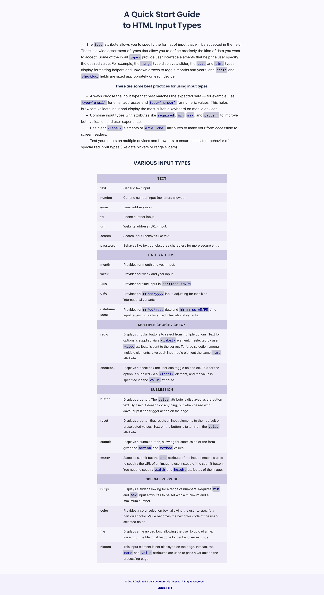

HTML Input Types: A Quick Start Guide / Codecademy

This is a solution to the **"Challenge Project: Build Your Own Cheat Sheet"** on Codecademy.

The goal of this project is to develop JavaScript functions that drive a small browser-based guessing game, allowing you to test your code and debug using the browser’s console.

---

## Table of contents

- [Table of contents](#table-of-contents)
- [Overview](#overview)
- [Project Goals](#project-goals)
- [Features](#features)
- [Screenshot](#screenshot)
- [Links](#links)
- [Built With](#built-with)
- [Author](#author)
 
---

## Overview

This project contains a series of open-ended requirements which describe the project you’ll be building.
There are many possible ways to correctly fulfill all of these requirements, and you should expect to use the internet, Codecademy, and other resources when you encounter a problem that you cannot easily solve.

---

## Project Goals

In this project, you’ll be building your own reference cheat sheet to help you build more websites in the future!
Although there are great places to learn HTML & CSS like Codecademy, the best reference for yourself is often your own notes and projects.

---

## Features

- A complete HTML reference cheat sheet for input types and attributes.
- Organized sections covering common HTML form elements.
- Easy-to-read examples demonstrating how to use each input type.
- Interactive testing within the browser to see how HTML inputs behave.
- Designed as a personal reference to speed up future web development projects.

---

## Screenshot

---

## Links

- **Project Description:** [Codecademy Challenge Project](https://www.codecademy.com/projects/practice/independent-project-html-documentation)
- **Live Demo:** [Live site URL](https://your-live-site-url.com)
- **Source Code:** [GitHub repository URL](https://github.com/...)

---

## Built With

- HTML5
- CSS3
- Browser console for testing and debugging

---

## Author

- **Website:** [Andrei Martinenko](https://www.frontender.biz/)  
- **GitHub:** [@AxinitM](https://github.com/AxinitM)  
- **Codecademy Profile:** [Andrei Martinenko](https://www.codecademy.com/profiles/system5869051486)